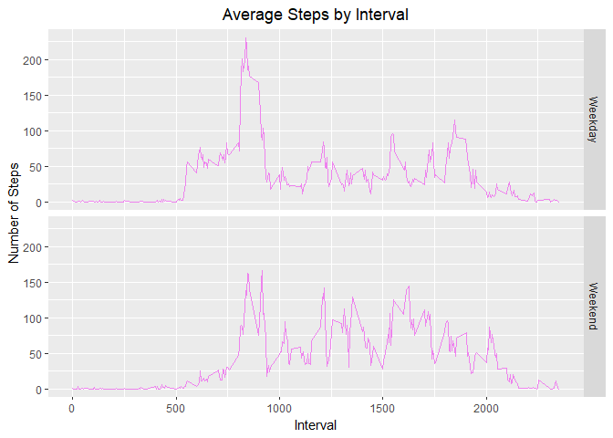

```r
knitr::opts_chunk$set(fig.path='Figs/')
```


```r
library(dplyr)
library(knitr)
library(ggplot2)
```


## Loading and preprocessing the data

```r
data <- read.csv("./activity.csv")
data$date <- as.Date(as.character(data$date), "%Y-%m-%d")
```


## What is mean total number of steps taken per day?

```r
# mean <- tapply(data$steps, data$date , mean, na.rm = TRUE)
totalStepsDf <- data %>%
  group_by(date) %>%
  summarise(totalSteps = sum(steps, na.rm = TRUE))
  

mean_ <- mean(totalStepsDf$totalSteps)
median_ <- median(totalStepsDf$totalSteps)
```
### Histogram of the total number of steps taken each day

```r
hist_fig1 <- with(totalStepsDf, hist(totalSteps, xlab = "Total Steps"
                                     ,main = "Histogram of Total Steps", col= "skyblue"))
```

<!-- -->

### Mean of the total number of steps taken per day is 9354.2295082.
### Median of the total number of steps taken per day is 10395.


## What is the average daily activity pattern?

```r
avgDailyActivity <- data %>%
  group_by(interval) %>%
  summarise(avgSteps = mean(steps, na.rm = T))
```


```r
with(avgDailyActivity
     , plot(interval, avgSteps, "l"
            , xlab = "Interval", ylab = "Average Steps"
            , main = "Time Series plot for Average Daily Activity"
            , col = "royalblue"))
```

<!-- -->

```r
maxVal <- max(avgDailyActivity$avgSteps)
maxInterval <- avgDailyActivity[which(avgDailyActivity$avgSteps == maxVal),]$interval
```

### On an avergae, 835 interval contains the maximum number of steps.


## Imputing missing values

### total number of missing values in the dataset 

```r
sum(is.na(data$steps))
```

```
## [1] 2304
```

### filling in all of the missing values in the dataset by taking mean for every interval

```r
means <- tapply( data$steps, data$interval, mean , na.rm=TRUE)

data_NA <- data[is.na(data$steps),]
data_not_NA <- data[!is.na(data$steps),]

data_NA$steps <- as.factor(data_NA$interval)
levels(data_NA$steps) <- means
levels(data_NA$steps) <- round(as.numeric(levels(data_NA$steps)))
data_NA$steps <- as.integer(as.vector(data_NA$steps))

new_data <- rbind(data_NA, data_not_NA)
```


### impact of imputing missing data on the estimates of the total daily number of steps


```r
new_totalStepsDf <- new_data %>%
  group_by(date) %>%
  summarise(totalSteps = sum(steps, na.rm = TRUE))
  

mean_2 <- mean(new_totalStepsDf$totalSteps)
median_2 <- median(new_totalStepsDf$totalSteps)

par(mfrow = c(1,2))
plot(hist_fig1, col = "skyblue", main = "Histogram 1", xlab = "Total Steps")
hist_fig2 <- with(new_totalStepsDf, 
                  hist(totalSteps, xlab = "Total Steps"
                       ,main = "Histogram 2", col= "blue"))
```

<!-- -->


#### Summary of Total Steps in first part of assignment 


```r
summary(totalStepsDf$totalSteps)
```

```
##    Min. 1st Qu.  Median    Mean 3rd Qu.    Max. 
##       0    6778   10395    9354   12811   21194
```
#### Summary of Total Steps with imputed NA values

```r
summary(new_totalStepsDf$totalSteps)
```

```
##    Min. 1st Qu.  Median    Mean 3rd Qu.    Max. 
##      41    9819   10762   10766   12811   21194
```
As can be seen the the Mean and Median value have incresed after imputing NA values, The minimum value has also changed although the maximum value is unchanged.


## Are there differences in activity patterns between weekdays and weekends?


```r
weekend <- c("Saturday", "Sunday")
new_data$day <- as.factor(ifelse(weekdays(new_data$date) %in% weekend, "Weekend", "Weekday"))

avgDailyActivity_byday <- aggregate(steps ~ interval + day, 
                                    data = new_data, FUN = mean)
head(avgDailyActivity_byday)
```

```
##   interval     day      steps
## 1        0 Weekday 2.28888889
## 2        5 Weekday 0.40000000
## 3       10 Weekday 0.15555556
## 4       15 Weekday 0.17777778
## 5       20 Weekday 0.08888889
## 6       25 Weekday 1.57777778
```

```r
plot <- ggplot(data = avgDailyActivity_byday, aes(interval, steps))
plot + geom_line(color = "violet") + facet_grid( day ~.) +
  xlab("Interval") + ylab("Number of Steps") + 
  ggtitle("Average Steps by Interval") +
  theme(plot.title = element_text(hjust = 0.5)) 
```

<!-- -->


